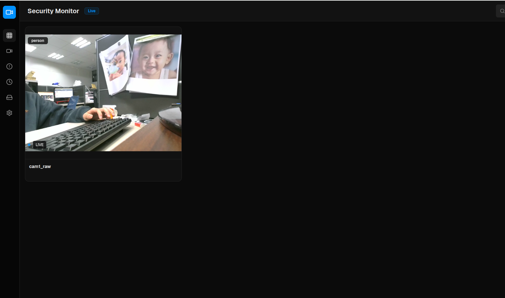
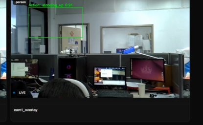
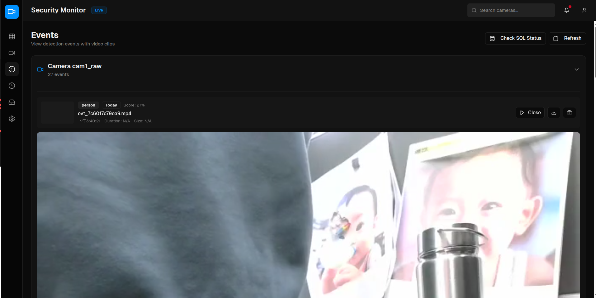
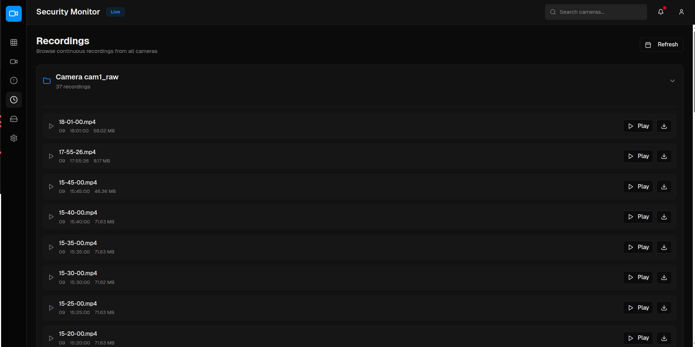
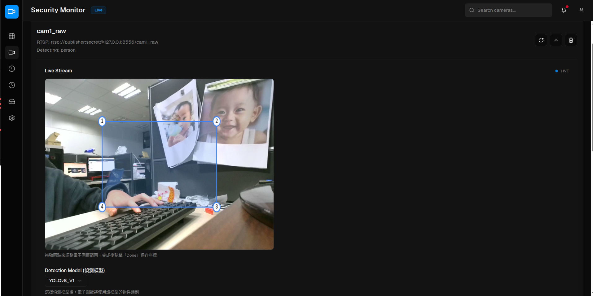

# 前端使用者操作手冊 (Frontend User Manual)

## 1. 介面總覽 (Interface Overview)
本系統提供直覺的網頁操作介面，主要功能包含即時影像監控、AI 行為偵測警示、歷史事件回放以及偵測區域設定。

*圖 1: 系統首頁介面總覽*

## 2. 即時監控 (Live View)

### 2.1 影像儀表板
- **多鏡頭瀏覽**: 畫面中央顯示所有已連接攝影機的即時影像。
- **即時偵測框**: 當系統偵測到特定物件或行為時，會在畫面中標示紅色或特定顏色的偵測框。
- **狀態顯示**: 每個畫面角落顯示攝影機名稱及連線狀態。

*圖 2: 即時偵測畫面示意*

## 3. 事件與回放 (Events & Playback)

### 3.1 事件列表 (Event Log)
- **即時通知**: 最新偵測到的事件會即時顯示在側邊欄或下方的事件列表中。
- **事件資訊**: 包含事件類型（如：人員入侵、跌倒偵測）、發生時間與攝影機來源。

*圖 3: 事件列表*

### 3.2 錄影回放 (Video Playback)
- **點擊回放**: 在事件列表中點擊任一項目，系統將彈出播放視窗。
- **片段控制**: 支援播放、暫停、下載事件片段。

*圖 4: 事件回放視窗*

## 4. 偵測設定 (Detection Settings)

### 4.1 電子圍籬 (Smart Fence)
- **繪製區域**: 在設定模式下，可直接於畫面上繪製多邊形區域。
- **規則設定**: 設定該區域的觸發條件（例如：進入區域、逗留時間過長）。

*圖 5: 電子圍籬繪製與設定*

### 4.2 模型與類別選擇 (Model & Class Selection)
- **AI 模型切換**: 針對不同的應用場景（例如：工安偵測、跌倒偵測），使用者可切換欲使用的 AI 模型。
- **偵測類別過濾**: 可勾選特定要偵測的物件類別（如：只偵測「人」或「車」）。
- **靈敏度調整**: 支援調整偵測靈敏度 (Confidence Threshold)，以優化偵測準確度。

*圖 6: 模型選擇與類別設定*
