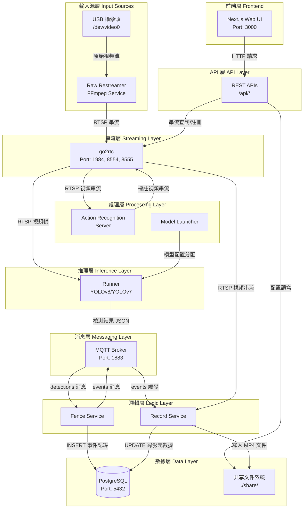

```mermaid
graph TB
    subgraph "輸入源層 Input Sources"
        USB[USB 攝像頭<br/>/dev/video0]
        RESTREAM[Raw Restreamer<br/>FFmpeg Service]
    end
    
    subgraph "前端層 Frontend"
        HTML[Next.js Web UI<br/>Port: 3000]
    end
    
    subgraph "API 層 API Layer"
        REST[REST APIs<br/>/api/*]
    end
    
    subgraph "串流層 Streaming Layer"
        GO2RTC[go2rtc<br/>Port: 1984, 8554, 8555]
    end
    
    subgraph "處理層 Processing Layer"
        ARS[Action Recognition<br/>Server]
        MODEL[Model Launcher]
    end
    
    subgraph "推理層 Inference Layer"
        RUNNER[Runner<br/>YOLOv8/YOLOv7]
    end
    
    subgraph "邏輯層 Logic Layer"
        FENCE[Fence Service]
        RECORD[Record Service]
    end
    
    subgraph "消息層 Messaging Layer"
        MQTT[MQTT Broker<br/>Port: 1883]
    end
    
    subgraph "數據層 Data Layer"
        PG[(PostgreSQL<br/>Port: 5432)]
        FILES[共享文件系統<br/>./share/]
    end
    
    %% 輸入源連接
    USB -->|"原始視頻流"| RESTREAM
    RESTREAM -->|"RTSP 串流"| GO2RTC
    
    %% 前端與 API
    HTML -->|"HTTP 請求"| REST
    REST -->|"串流查詢/註冊"| GO2RTC
    REST -->|"配置讀寫"| FILES
    
    %% 處理層
    GO2RTC -->|"RTSP 視頻串流"| ARS
    ARS -->|"標註視頻串流"| GO2RTC
    GO2RTC -->|"RTSP 視頻幀"| RUNNER
    MODEL -->|"模型配置分配"| RUNNER
    RUNNER -->|"檢測結果 JSON"| MQTT
    
    %% 邏輯層
    MQTT -->|"detections 消息"| FENCE
    FENCE -->|"events 消息"| MQTT
    FENCE -->|"INSERT 事件記錄"| PG
    MQTT -->|"events 觸發"| RECORD
    GO2RTC -->|"RTSP 視頻串流"| RECORD
    RECORD -->|"寫入 MP4 文件"| FILES
    RECORD -->|"UPDATE 錄影元數據"| PG
```
